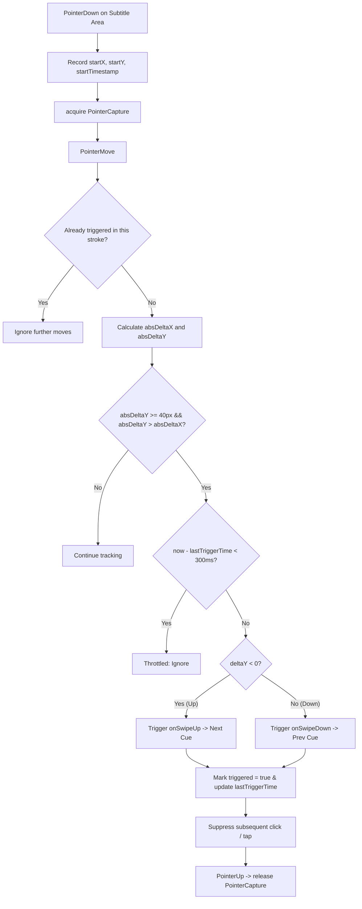

# Phase 09: Gesture Navigation - Research

**Researched:** 2026-09-02  
**Domain:** 暗场影院触控手势字幕导航（UI-04）、首次进入轻量手势引导与持久化（UI-05）  
**Confidence:** HIGH  

---

<user_constraints>
## User Constraints (from CONTEXT.md)

### Locked Decisions

#### 手势触发与防误触
- **D-01:** 手势生效区域为全屏字幕区（除 Timeline/控制区外的中央黑屏区域），最适合影院盲操，无需瞄准。
- **D-02:** 有效滑动阈值采用短阈值 40px，轻划即可触发，配合方向锁定降低误触。
- **D-03:** 冲突分流采用垂直优先：垂直位移大于水平位移时判定为手势并阻止后续点击；水平或小幅位移交由 Timeline/控制区处理。
- **D-04:** 连续滑动限速为 300ms 节流，一次滑动后 300ms 内忽略重复触发，兼顾防抖与快速逐句浏览。

#### 逐句跳转语义
- **D-05:** 映射为上滑=下一句、下滑=上一句，符合“上推前进、下拉回退”的直觉。
- **D-06:** 边界行为为停留：已到第一句前或最后一句后保持当前字幕或黑屏，不循环。
- **D-07:** 空档中的跳转按时间最近句处理：上滑跳到空档后下一句的开头，下滑跳到空档前上一句的开头，空档本身保持黑屏不吸附。
- **D-08:** 重叠字幕按原 SRT 数组顺序跳转，不按结束时间重排，与 Phase 7 D-06 保持一致。

#### 与播放状态联动
- **D-09:** 跳转后保持原播放状态：播放中继续播放，暂停中保持暂停并立即显示目标句或空白。
- **D-10:** 跳转立即同步 Timeline 进度与 wall-clock 会话，并触发一次 Session 持久化，刷新后续播落在新手势位置。
- **D-11:** 目标时间点为目标 cue 的 start，完整呈现该句。
- **D-12:** 切换无动画直接切除，暗场中避免额外亮度与延迟。

#### 首次引导与可发现性
- **D-13:** 引导样式为居中半透明遮罩，低亮度居中图文，暗场可见但不刺眼。
- **D-14:** 出现与消失时机为首次进入播放页 1 秒后出现，点击任意处或 3 秒后轻点手势自动消失。
- **D-15:** 关闭后仅一次不再出现，使用 localStorage 标记已看过。
- **D-16:** 不提供“再次查看”入口，保持极简；手势可通过自然尝试发现。

### the agent's Discretion
- 手势防误触的垂直/水平判定比例、回弹或轻微振动反馈等细节由实现者根据真机手感决定，但必须保持 40px 阈值与 300ms 节流的约束。
- 引导遮罩的具体文案、图标与 CSS 细节由实现者决定，但必须保持一次性、1 秒延迟出现、可任意点击关闭且不再打扰的约束。

### Deferred Ideas (OUT OF SCOPE)
- 左右滑动或其他手势扩展 — 属于未来手势能力，未纳入 Phase 9。
- 控制区分层与自动隐藏的进一步优化 — 属于 Phase 10。

#### Reviewed Todos (not folded)
- `playback-toolbar-layout.md` — 已确认属于 Phase 10 的 Control Layering & Settings Drawer，不并入 Phase 9。
</user_constraints>

---

<phase_requirements>
## Phase Requirements

| ID | Requirement | Research Support |
|---|---|---|
| **UI-04** | 暗场触控手势 — 上滑跳转下一句字幕、下滑跳转上一句字幕，盲操无误触，同步更新进度条和内部时钟状态 | 提取纯函数 `findCueNavigationTarget` 处理正常/空档/重叠/边界四种时序场景；提取纯函数 `detectGesture` 实现 40px 阈值与垂直优先锁定；React hook `useGestureNavigation` 绑定全屏字幕容器，通过 Pointer Events + `setPointerCapture` 实现零误触；跳转统一调用 Phase 7 已验证的 `usePlaybackEngine.seek(targetCue.start)` 原子同步 Engine、Session、Timeline 与 IndexedDB [VERIFIED: src/hooks/usePlaybackEngine.ts:L237-L240]。 |
| **UI-05** | 首次进入手势引导 — 播放页首次进入展示轻量手势提示，可关闭且不再打扰 | 独立组件 `GestureGuide.tsx`：挂载于播放页中央遮罩层（z-index 150），低照度暗场文字与简明箭头；首次进入播放页 1000ms 后浮现，点击任意处/手势操作/3000ms 定时器自动关闭；关闭状态持久化于 localStorage（键名 `cinemasyncsubs-gesture-guide-seen`），一次性提示永不再现。 |
</phase_requirements>

---

## Summary

Phase 09 为 CinemaSyncSubs 赋予了在暗场影院中至关重要的**盲操触控手势能力**。影院观影环境下，观众视线紧盯银幕，无法精准瞄准屏幕底部的细微控制按钮；当发生“走神错过一句”或“想重看上一句”时，全屏任意位置的快速滑动手势是最符合直觉、干扰最小的交互方式。

本阶段的核心基础设施已完备：
1. **跳转与会话同步路径**：Phase 7 交付的 `usePlaybackEngine.seek(targetMs)` [VERIFIED: src/hooks/usePlaybackEngine.ts:L237-L240] 已支持播放中/暂停中精确定位、原子重锚定 wall-clock Session（`seekSession` [VERIFIED: src/playback/session.ts:L108-L119]）、驱动现有 persist effect 异步写入 IndexedDB，且自动联动 Timeline 进度显示（UI-01/UI-02 [VERIFIED: src/components/Timeline.tsx:L87-L90]）。
2. **零新依赖约束**：沿用 Web 平台原生 **Pointer Events** 与 CSS `touch-action: none`，无需引入 Hammer.js、framer-motion 或 react-use-gesture 等任何第三方包，完全维持项目轻量零外部依赖标准 [VERIFIED: package.json:L13-L30]。
3. **测试架构延续性**：遵循 Phase 7 与 Phase 8 的成功实践，手势判决算法（位移向量/垂直优先/40px 阈值/300ms 节流）与逐句定位算法（正常/空档/重叠/边界停留）全部抽取为无 DOM、无时钟副作用的纯函数模块 `src/playback/cueNavigation.ts`，在 Vitest 的 `environment: 'node'` 下实现 100% 确定性的单元测试覆盖 [VERIFIED: vitest.config.ts:L1-L9]。

本阶段的核心技术难点在于：
- **事件模型与误触隔离**：全屏手势层必须与底部的 Timeline 拖拽、播放/暂停按钮及设置按钮清晰分流。手势层置于 `.subtitle-container` [VERIFIED: src/index.css:L35-L45]，利用天然 DOM 层叠顺序与 Pointer Capture，阻止垂直滑动演变成点击事件穿透；在容器上声明 `touch-action: none`，彻底杜绝 iOS/Android 移动端浏览器的下拉刷新（pull-to-refresh）和橡皮筋滚动干扰。
- **逐句跳转的时序边界**：播放中处于字幕空档（Blank Gap）、首尾边界、以及原 SRT 数组重叠时的跳转必须严格遵循 D-06（边界停留不循环）、D-07（空档跳最近句起点）、D-08（重叠依原始数组序号），通过纯函数数学计算消除所有歧义。
- **暗场极简引导**：引导遮罩必须在 1 秒延迟后平滑出现，不晃眼、无动画强光污染，3 秒自动淡出或任意点击/滑动即刻销毁，并在 localStorage 中标记永不复现。

---

## Architectural Responsibility Map & Integration Points

```
+-------------------------------------------------------------------------------+
| App.tsx (Playback View: view === 'playback' && subtitle)                     |
|                                                                               |
|  +-------------------------------------------------------------------------+  |
|  | SubtitleDisplay.tsx (.subtitle-container: fixed inset: 0)               |  |
|  |  * CSS: touch-action: none, user-select: none                           |  |
|  |  * Bound via useGestureNavigation hook                                   |  |
|  |  * Pointerdown -> Pointermove -> Pointerup                               |  |
|  |  * 40px threshold, vertical-dominant check (D-02, D-03)                  |  |
|  |  * 300ms throttle (D-04)                                                 |  |
|  |  * Dispatches onSwipeUp / onSwipeDown                                    |  |
|  +-------------------------------------------------------------------------+  |
|                                                                               |
|  +-------------------------------------------------------------------------+  |
|  | GestureGuide.tsx (z-index: 150, semi-transparent low-luminance scrim)    |  |
|  |  * Mounts 1s after entering playback view if unseen (D-14)              |  |
|  |  * Dismisses on tap, on swipe, or after 3s auto-dismiss (D-14)          |  |
|  |  * Persists flag to localStorage 'cinemasyncsubs-gesture-guide-seen'     |  |
|  +-------------------------------------------------------------------------+  |
|                                                                               |
|  +-------------------------------------------------------------------------+  |
|  | PlaybackControls.tsx (.playback-controls: fixed bottom: 24px, z-index: 100)| |
|  |  * Timeline slider (scrubbing), Buttons (Play/Pause, Offset, Dim, etc.)   |  |
|  |  * Captures its own pointer events; gestures on controls bypass subtitle |  |
|  +-------------------------------------------------------------------------+  |
|                                                                               |
|  Gesture Handler Logic:                                                       |
|    onSwipeUp()   -> targetMs = findCueNavigationTarget(cues, now, 'next')     |
|    onSwipeDown() -> targetMs = findCueNavigationTarget(cues, now, 'prev')     |
|    if (targetMs !== null) -> seek(targetMs)                                   |
|                                                                               |
|  Seek Execution:                                                              |
|    usePlaybackEngine.seek(targetMs) [VERIFIED: src/hooks/usePlaybackEngine.ts]|
|      +-- PlaybackEngine.seek(targetMs) (engine position & cue change)         |
|      +-- seekSession(session, targetMs, now) (wall-clock anchor update)       |
|      +-- persist effect (IndexedDB saveSession)                               |
|      +-- Timeline displayValue updates immediately via sessionElapsedMs       |
+-------------------------------------------------------------------------------+
```

### Layer Responsibilities

| Component / Module | Responsibility | Source Reference |
|---|---|---|
| `src/playback/cueNavigation.ts` | **纯函数计算层**：实现 `findCueNavigationTarget`（逐句跳转目标点算法）、`detectGesture`（滑动向量与方向判决）、`isGestureThrottled`（300ms 限速判决）、`hasSeenGestureGuide` / `markGestureGuideSeen`（本地存储辅助） | 新增模块，无 DOM / 无 React 依赖 |
| `src/hooks/useGestureNavigation.ts` | **手势识别 Hook**：封装 Pointer Events 状态机，维护单次滑动起点、Pointer Capture、方向判据、300ms 节流锁与阻止误触点击穿透 | 新增 Hook |
| `src/components/GestureGuide.tsx` | **首次引导 UI**：居中半透明低亮度遮罩，展示极简上下滑手势说明；管理 1s 延迟出现与 3s 自动关闭生命周期 | 新增组件（UI-05） |
| `src/components/SubtitleDisplay.tsx` | **手势宿主容器**：`.subtitle-container` 承载手势 Pointer 事件处理器，声明 `touch-action: none` 阻断浏览器默认行为 | [VERIFIED: src/components/SubtitleDisplay.tsx:L38-L42] |
| `src/hooks/usePlaybackEngine.ts` | **定位提交入口**：提供 `seek(targetMs)` 原子方法，同步更新 Engine 与 Session，触发既有持久化与字幕重绘 | [VERIFIED: src/hooks/usePlaybackEngine.ts:L237-L240] |
| `src/App.tsx` | **胶水与协调层**：在播放视图中将 `useGestureNavigation` 与 `usePlaybackEngine.seek` 串联；挂载 `GestureGuide` | [VERIFIED: src/App.tsx:L362-L396] |
| `src/i18n/translations.ts` | **国际化文案**：新增手势引导的英中双语文本 | [VERIFIED: src/i18n/translations.ts:L3-L116] |

---

## Standard Stack & Technical Patterns

### Core Stack
- **React 18.3.1**: 原生合成事件 `onPointerDown`、`onPointerMove`、`onPointerUp`、`onPointerCancel` [VERIFIED: package.json:L17]。
- **Web Pointer Events API**: W3C 标准级指针事件系统，统一抹平 Mouse、Touch、Pen 输入，天然支持 `e.currentTarget.setPointerCapture(e.pointerId)` 与 `releasePointerCapture` [ASSUMED]。
- **CSS `touch-action: none`**: 声明于手势监听区域，在浏览器合成线程禁用页面默认手势（禁止纵向下拉刷新、橡皮筋反弹及滚动），确保移动端手势事件 100% 交付给 JavaScript [ASSUMED]。
- **Web Storage API (`localStorage`)**: 存储键 `cinemasyncsubs-gesture-guide-seen` 标记首次引导已被阅读，遵循项目既有键前缀模式 [VERIFIED: src/hooks/usePersistedSettings.ts:L20]。
- **Vitest 4.1.10 (node environment)**: 针对纯函数的全分支断言 [VERIFIED: vitest.config.ts:L5-L7]。

---

### Key Technical Patterns

#### 1. Touch/Pointer 事件模型与冲突分流 (D-01, D-02, D-03, D-04)

移动端浏览器环境下手势交互的最大陷阱在于**误触**（点击被误判为滑动，或小幅水平拨弄被误判为纵向跳句）以及**浏览器原生下拉刷新劫持**。

- **区域隔离 (D-01)**：
  在 `App.tsx` 中，播放视图包含全屏的 `.subtitle-container`（`position: fixed; inset: 0`）与底部的 `.playback-controls`（`position: fixed; bottom: 24px; z-index: 100`）[VERIFIED: src/index.css:L35-L45, L209-L227]。
  - 当控制栏显示时，用户触摸 Timeline 进度条或按钮，事件直接被 `z-index: 100` 的控件消费；
  - 当控制栏隐藏时（`controlsVisible === false`），`.playback-controls.hidden` 具有 `pointer-events: none` [VERIFIED: src/index.css:L224-L227]，此时全屏幕 100% 面积均成为纯粹的手势感应区；
  - 即使控制栏显示，中央 70% 以上的黑屏区域依然直达 `.subtitle-container`。
- **Pointer Capture 机制**：
  在 `pointerdown` 阶段，若事件起源于手势感应区，立即调用 `element.setPointerCapture(e.pointerId)`。这确保了用户若从屏幕中央起手、快速向下滑动至屏幕底部（甚至滑出屏幕外），后续所有 `pointermove` 与 `pointerup` 仍然精确派发给手势处理器，不会被底部控件意外截获。
- **短阈值与垂直优先判据 (D-02, D-03)**：
  ```ts
  const absDeltaX = Math.abs(currentX - startX)
  const absDeltaY = Math.abs(currentY - startY)
  // 阈值 40px 且垂直位移严格大于水平位移
  if (absDeltaY >= 40 && absDeltaY > absDeltaX) {
    return deltaY < 0 ? 'up' : 'down'
  }
  ```
  - 当位移小于 40px 时，视为微小抖动或静止点击，不触发手势；
  - 当水平位移大于等于垂直位移时，判定为水平滑动，放弃纵向处理（保留给后续手势扩展或交由底层控件）；
  - 一旦判定为有效手势，在当前触摸生命周期中标记 `didTrigger = true`，并在随后的 `pointerup` / `click` 阶段抑制点击事件（`e.preventDefault()` / 阻止冒泡），避免触发屏幕点击控制栏唤醒或引导误关。
- **单次接触限触发一次与 300ms 限速 (D-04)**：
  - 一次完整的按压（down -> move -> up）最多触发**一次**跳句。禁止按住屏幕连续拖拉连续跳句（这会导致暗场中失控连跳数句）；
  - 维护全局 `lastTriggerTime`，若两次跳句间隔小于 300ms，丢弃第二次触发。



---

#### 2. 逐句跳转目标计算算法 (D-05, D-06, D-07, D-08, D-11)

跳转语义的准确性是手势体验的生命线。算法必须严格满足以下五大规则：
1. **语义映射 (D-05)**：上滑（`deltaY < 0`）跳转下一句（`next`），下滑（`deltaY > 0`）跳转上一句（`prev`）。
2. **目标点精准 (D-11)**：跳转的目标时间点一律为目标 cue 的 `start` 时间（offset-inclusive 空间），确保跳转后完整展示该句文本。
3. **播放状态保持 (D-09)**：调用既有 `usePlaybackEngine.seek(targetMs)` [VERIFIED: src/hooks/usePlaybackEngine.ts:L237-L240]。播放中跳转无缝继续播放；暂停中跳转保持暂停，引擎立即通过 `findActiveCue` 触发 `onCueChange` 刷新界面字幕。
4. **空档处理 (D-07)**：当当前播放时间落入两句字幕之间的空白空档（Blank Gap）时：
   - 上滑跳到该空档之后第一句的 `start`；
   - 下滑跳到该空档之前第一句的 `start`；
   - 空档本身保持无字幕状态，不做粘滞吸附。
5. **边界停留 (D-06)**：
   - 若已经在最后一句（或处于最后一句之后的尾部空档），上滑（next）不循环，保持当前画面（返回 `null`，不执行 seek）；
   - 若已经在第一句（或处于第一句之前的片头空档），下滑（prev）不循环，保持当前画面（返回 `null`，不执行 seek）。
6. **重叠字幕按原 SRT 数组顺序 (D-08)**：
   若字幕存在时间区间重叠（例如背景音乐词与人物台词并发），不按 `end` 时间重排，直接沿着 `cues` 数组原索引（`i - 1` / `i + 1`）跳转。

```mermaid
flowchart TD
    Start([findCueNavigationTarget: cues, currentMs, direction, activeIndex]) --> EmptyCheck{cues is empty?}
    EmptyCheck -- Yes --> RetNull[Return null]
    EmptyCheck -- No --> CheckActive{Is activeIndex valid and matches currentMs?}
    
    CheckActive -- Yes --> ActiveBranch[currIdx = activeIndex]
    CheckActive -- No --> SearchActive{cues.findIndex where start <= currentMs < end}
    
    SearchActive -- Found idx --> ActiveBranch2[currIdx = idx]
    SearchActive -- Not found (-1) --> GapBranch[Current time is in GAP]
    
    ActiveBranch --> DirCheck{direction == 'next'?}
    ActiveBranch2 --> DirCheck
    
    DirCheck -- 'next' (Swipe Up) --> NextInActive{currIdx + 1 < cues.length?}
    NextInActive -- Yes --> RetNext[Return cues[currIdx + 1].start]
    NextInActive -- No --> StayEnd[Boundary: Return null]
    
    DirCheck -- 'prev' (Swipe Down) --> PrevInActive{currIdx - 1 >= 0?}
    PrevInActive -- Yes --> RetPrev[Return cues[currIdx - 1].start]
    PrevInActive -- No --> StayStart[Boundary: Return null]
    
    GapBranch --> FindAfter{Find first cue with start > currentMs}
    FindAfter -- Found nextIdx --> GapDir{direction == 'next'?}
    GapDir -- 'next' --> RetGapNext[Return cues[nextIdx].start]
    GapDir -- 'prev' --> GapPrevCheck{nextIdx - 1 >= 0?}
    GapPrevCheck -- Yes --> RetGapPrev[Return cues[nextIdx - 1].start]
    GapPrevCheck -- No --> RetGapStartNull[Before first cue: Return null]
    
    FindAfter -- None (after all cues) --> AfterLastDir{direction == 'next'?}
    AfterLastDir -- 'next' --> RetAfterNull[After last cue: Return null]
    AfterLastDir -- 'prev' --> RetLastStart[Return cues[cues.length - 1].start]
```

---

#### 3. 首次引导遮罩设计与生命周期 (UI-05, D-13, D-14, D-15, D-16)

- **视觉层级与暗场约束 (D-13, D-12)**：
  - 遮罩采用 `position: fixed; inset: 0; z-index: 150;`；
  - 背景为超低照度半透明纯黑：`rgba(0, 0, 0, 0.75)`，保护观众眼睛适应暗场；
  - 图标与文本采用哑光灰（`#888888` / `#aaaaaa`），严禁使用高光纯白（`#ffffff`）以防刺眼；
  - 切换无 CSS 动画或过渡闪烁，直接挂载/卸载，避免造成暗场光污染。
- **时间线控制与关闭触发 (D-14, D-15)**：
  1. 用户进入播放视图（`view === 'playback'`），检查 localStorage 键 `cinemasyncsubs-gesture-guide-seen`；
  2. 若未看过：启动 1000ms 延时计时器；
  3. 1000ms 届满：遮罩显示，同时启动 3000ms 自动关闭计时器；
  4. 任意外部干预发生（点击屏幕任意处、在遮罩上手势滑动、或 3000ms 倒计时结束）：
     - 立即关闭遮罩；
     - 写入 `localStorage.setItem('cinemasyncsubs-gesture-guide-seen', 'true')`；
     - 清除所有待执行计时器；
  5. 若用户在 1000ms 延迟期内即主动滑动了字幕：视同已掌握手势，立即取消 1000ms 计时器并持久化标记为已看过；
  6. 页面切换离开播放视图（退出或后退）时，清理全部计时器，防止内存泄漏或幽灵渲染。

---

## Anti-Patterns & Pitfalls to Avoid

### Anti-Pattern 1: 手势完成后的合成点击穿透 (Click Bleed-Through)
- **现象**：用户在屏幕上完成一次 60px 的上滑跳句后，手指抬起时浏览器派发了 `pointerup`，紧接着在抬手点派发了合成的 `click` 事件。此时若底层正好是播放控制按钮或将来的自动隐藏唤醒层，会引发意料之外的二次动作。
- **根因**：移动端与桌面浏览器标准的 Pointer -> Mouse -> Click 合成事件机制。
- **对策**：在手势识别器中设置 `didGestureRef` 标志位。当滑动位移达到 40px 并判定为手势时，置 `didGestureRef.current = true`。在随后的 `pointerup` 或容器级 `onClickCapture` 中阻断事件；并设置一个微任务/50ms 延时重置该标志位。

### Anti-Pattern 2: 未配置 `touch-action: none` 导致滑动被移动端浏览器劫持
- **现象**：在 Android Chrome 或 iOS Safari 上，用户在全屏字幕区向下滑动时，页面顶端出现旋转的下拉刷新菊花（Pull-to-refresh），或整页上下发生橡皮筋弹性滚动，手势事件中断并派发 `pointercancel`。
- **根因**：移动端浏览器的默认触控手势优先级高于未声明 `touch-action` 的 DOM 元素。
- **对策**：必须在 `.subtitle-container` CSS 中强制声明 `touch-action: none;` 与 `-webkit-user-select: none; user-select: none;` [VERIFIED: src/index.css:L43-L44]。

### Anti-Pattern 3: 手势跳转误用 `previewSeek` 而非 `seek`
- **现象**：滑动跳句后，界面字幕变了，但刷新页面后播放进度回退到滑动前的位置；或者底部的 Timeline 进度条没有更新。
- **根因**：Phase 8 新增的 `previewSeek` 是专门为 Timeline 连续拖拽设计的**纯引擎预览方法**（不更新 React session，不写 IndexedDB）[VERIFIED: src/hooks/usePlaybackEngine.ts:L243-L257]。手势跳转是一次**确定性的离散跳转**（Commit Seek），必须直接调用 `usePlaybackEngine.seek(targetMs)` [VERIFIED: src/hooks/usePlaybackEngine.ts:L237-L240]，触发 `seekSession` 重设 wall-clock 锚点并持久化至 IndexedDB。

### Anti-Pattern 4: 播放态跳到末尾触发 Auto-Stop
- **现象**：当播放进行到最后几句时，连续上滑跳句，突然播放器自动停止并退出了播放页。
- **根因**：`PlaybackEngine.tick()` 在 `elapsed >= lastCue.end` 且当前无 active cue 时，会自动调用 `stop()` 并触发 `onEnded()` [VERIFIED: src/playback/PlaybackEngine.ts:L187-L191]。
- **对策**：D-06 规则“边界停留”。`findCueNavigationTarget` 在遇到最后一条字幕时，上滑跳句直接返回 `null`。而且，任何合法 cue 的 `start` 时间必定严格小于 `lastCue.end`（`cue.start < cue.end <= lastCue.end`），因此跳转到 `cue.start` 绝不会越过末尾，从算法根源杜绝了误触 auto-stop。

### Anti-Pattern 5: 首次引导遮罩的高照度视觉污染
- **现象**：影院中启动播放，突然弹出一个白色高亮对话框或亮色图标弹窗，瞬间照亮周围观众席。
- **根因**：UI 未遵循 OLED 极黑与暗场原则。
- **对策**：全遮罩严格使用 `rgba(0, 0, 0, 0.75)` 深色半透明底色，所有图形与文本均限制在 `#888888` 暗灰色阶，无发光边框，无白色背景卡片。

---

## Don't Hand-Roll & Runtime State Inventory

### Don't Hand-Roll

| Problem | Don't Hand-Roll | Use Instead | Rationale |
|---|---|---|---|
| 指针坐标与多点触控跟踪 | 不要自己解析 `e.touches` / `e.changedTouches` 数组并处理多指 | 原生 `PointerEvent` + `e.isPrimary` | Pointer Events 统一了单指触控与鼠标操作，`e.isPrimary` 自动过滤次要触点，无需自行维护多指映射 [ASSUMED] |
| 跨元素滑动追踪 | 不要使用全局 `document.addEventListener('pointermove')` | `e.currentTarget.setPointerCapture(e.pointerId)` | 浏览器标准提供的指针捕获机制，一旦锁定，即使滑出元素边界也持续捕获事件，并在 `pointerup` 自动释放 [ASSUMED] |
| 播放位置与会话更新 | 不要分别修改 engine 内部时钟与 session 对象 | `usePlaybackEngine.seek(targetMs)` | Phase 7 已验证封装原子方法，一步完成 EngineMonotonic、SessionWallClock、IndexedDB 同步 [VERIFIED: src/hooks/usePlaybackEngine.ts:L237-L240] |
| 时间格式转换 | 不要手写时分秒字符串拼接 | `formatElapsedHMS(ms)` | [VERIFIED: src/playback/session.ts:L167-L173] 健壮处理负值与超长时间 |

---

### Runtime State Inventory

| State Item | Type | Storage Location | Lifetime | Purpose |
|---|---|---|---|---|
| `lastTriggerTime` | `number` (ref) | `useGestureNavigation` | 页面生命周期 | 记录上次有效跳句的时间戳，实施 300ms 节流 (D-04) |
| `startCoords` | `{ x: number, y: number, time: number } \| null` (ref) | `useGestureNavigation` | 单次手势触控 (down -> up) | 记录手势起始点坐标，用于计算 $\Delta x$ 与 $\Delta y$ |
| `isGestureTriggeredInStroke` | `boolean` (ref) | `useGestureNavigation` | 单次手势触控 (down -> up) | 保证单次划动只能跳一句，防止连续拖移失控 |
| `suppressClickUntil` | `number` (ref) | `useGestureNavigation` | 手势触发后 ~50ms | 防止跳句后的抬手动作触发底层的 click 事件 |
| `guideVisible` | `boolean` (state) | `GestureGuide` 或 `App` | 首次进入播放视图 | 控制首次进入引导遮罩的显示状态 |
| `guideSeen` | `boolean` (persisted) | `localStorage` | 永久有效 | 键 `cinemasyncsubs-gesture-guide-seen`，标记引导是否已关闭 (D-15) |

---

## Code Examples & Architecture Diagrams

### 1. 核心纯函数算法：`src/playback/cueNavigation.ts`

```ts
import type { Cue } from '../types/subtitle'

/**
 * Validates whether a gesture is a vertical swipe exceeding threshold (D-02, D-03).
 *
 * @param startX Initial X coordinate
 * @param startY Initial Y coordinate
 * @param currentX Current X coordinate
 * @param currentY Current Y coordinate
 * @param threshold Minimum vertical movement required (default 40px)
 * @returns 'up' | 'down' | null
 */
export function detectGesture(
  startX: number,
  startY: number,
  currentX: number,
  currentY: number,
  threshold: number = 40
): 'up' | 'down' | null {
  const deltaX = currentX - startX
  const deltaY = currentY - startY
  const absDeltaX = Math.abs(deltaX)
  const absDeltaY = Math.abs(deltaY)

  // Vertical movement must be at least threshold AND strictly greater than horizontal (D-02, D-03)
  if (absDeltaY < threshold || absDeltaY <= absDeltaX) {
    return null
  }

  // DeltaY < 0 indicates upward swipe towards top of screen (D-05)
  return deltaY < 0 ? 'up' : 'down'
}

/**
 * Evaluates whether a gesture is throttled by 300ms limit (D-04).
 */
export function isGestureThrottled(
  now: number,
  lastTriggerTime: number,
  throttleMs: number = 300
): boolean {
  return now - lastTriggerTime < throttleMs
}

/**
 * Computes target seek time (start of target cue) for next/prev cue navigation (D-05~D-11).
 *
 * Handles:
 * - Normal playback within an active cue
 * - Blank gaps between cues (D-07: next goes to next cue start, prev to prev cue start)
 * - Boundaries (D-06: stay at first/last cue, return null)
 * - Overlapping cues (D-08: navigate by original array order)
 *
 * @param cues Array of subtitle cues
 * @param currentMs Current playback elapsed time (offset-inclusive)
 * @param direction 'next' (swipe up) or 'prev' (swipe down)
 * @param activeIndex Currently active cue index from engine hint (optional)
 * @returns Target timestamp in ms, or null if boundary reached (no-op)
 */
export function findCueNavigationTarget(
  cues: Cue[],
  currentMs: number,
  direction: 'next' | 'prev',
  activeIndex: number = -1
): number | null {
  if (!cues || cues.length === 0) return null

  // Determine current active cue index
  let currIdx = -1
  if (activeIndex >= 0 && activeIndex < cues.length) {
    const cue = cues[activeIndex]
    if (currentMs >= cue.start && currentMs < cue.end) {
      currIdx = activeIndex
    }
  }

  // Fallback search if activeIndex not matching or not provided
  if (currIdx === -1) {
    currIdx = cues.findIndex((c) => currentMs >= c.start && currentMs < c.end)
  }

  // Case 1: Currently inside a valid cue
  if (currIdx !== -1) {
    if (direction === 'next') {
      const targetIdx = currIdx + 1
      return targetIdx < cues.length ? cues[targetIdx].start : null
    } else {
      const targetIdx = currIdx - 1
      return targetIdx >= 0 ? cues[targetIdx].start : null
    }
  }

  // Case 2: Currently in a blank gap (or before first / after last cue)
  // Find first cue starting strictly after currentMs
  const nextCueIdx = cues.findIndex((c) => c.start > currentMs)

  if (direction === 'next') {
    // Next cue after the gap
    return nextCueIdx !== -1 ? cues[nextCueIdx].start : null
  } else {
    // Previous cue before the gap
    if (nextCueIdx !== -1) {
      const prevCueIdx = nextCueIdx - 1
      return prevCueIdx >= 0 ? cues[prevCueIdx].start : null
    } else {
      // After all cues: last cue is the previous cue before this end gap
      return cues[cues.length - 1].start
    }
  }
}

/** Storage key for first-time gesture guide */
export const GESTURE_GUIDE_STORAGE_KEY = 'cinemasyncsubs-gesture-guide-seen'

export function hasSeenGestureGuide(storage?: Pick<Storage, 'getItem'>): boolean {
  try {
    const store = storage ?? (typeof window !== 'undefined' ? window.localStorage : undefined)
    return store?.getItem(GESTURE_GUIDE_STORAGE_KEY) === 'true'
  } catch {
    return false
  }
}

export function markGestureGuideSeen(storage?: Pick<Storage, 'setItem'>): void {
  try {
    const store = storage ?? (typeof window !== 'undefined' ? window.localStorage : undefined)
    store?.setItem(GESTURE_GUIDE_STORAGE_KEY, 'true')
  } catch {
    // Ignore quota or security errors in private browsing
  }
}
```

---

### 2. 手势识别 Hook：`src/hooks/useGestureNavigation.ts`

```ts
import { useRef, useCallback } from 'react'
import type { PointerEvent as ReactPointerEvent } from 'react'
import { detectGesture, isGestureThrottled } from '../playback/cueNavigation'

interface UseGestureNavigationOptions {
  onSwipeUp: () => void
  onSwipeDown: () => void
  disabled?: boolean
}

export function useGestureNavigation({
  onSwipeUp,
  onSwipeDown,
  disabled = false,
}: UseGestureNavigationOptions) {
  const startCoordsRef = useRef<{ x: number; y: number } | null>(null)
  const pointerIdRef = useRef<number | null>(null)
  const hasTriggeredRef = useRef(false)
  const lastTriggerTimeRef = useRef(0)
  const didSwipeRef = useRef(false)

  const handlePointerDown = useCallback(
    (e: ReactPointerEvent<HTMLElement>) => {
      if (disabled || !e.isPrimary || e.button !== 0) return

      startCoordsRef.current = { x: e.clientX, y: e.clientY }
      pointerIdRef.current = e.pointerId
      hasTriggeredRef.current = false
      didSwipeRef.current = false

      // Capture pointer to track moves across the viewport
      try {
        e.currentTarget.setPointerCapture?.(e.pointerId)
      } catch {
        // Safe fallback for environments lacking pointer capture
      }
    },
    [disabled]
  )

  const handlePointerMove = useCallback(
    (e: ReactPointerEvent<HTMLElement>) => {
      if (!startCoordsRef.current || pointerIdRef.current !== e.pointerId) return
      if (hasTriggeredRef.current) return

      const gesture = detectGesture(
        startCoordsRef.current.x,
        startCoordsRef.current.y,
        e.clientX,
        e.clientY,
        40
      )

      if (gesture === null) return

      const now = Date.now()
      if (isGestureThrottled(now, lastTriggerTimeRef.current, 300)) return

      // Valid gesture confirmed
      hasTriggeredRef.current = true
      lastTriggerTimeRef.current = now
      didSwipeRef.current = true

      if (gesture === 'up') {
        onSwipeUp()
      } else {
        onSwipeDown()
      }
    },
    [onSwipeUp, onSwipeDown]
  )

  const handlePointerUp = useCallback(
    (e: ReactPointerEvent<HTMLElement>) => {
      if (pointerIdRef.current !== e.pointerId) return

      // Handle fast flick that may not have caught threshold on move
      if (startCoordsRef.current && !hasTriggeredRef.current) {
        const gesture = detectGesture(
          startCoordsRef.current.x,
          startCoordsRef.current.y,
          e.clientX,
          e.clientY,
          40
        )
        const now = Date.now()
        if (gesture && !isGestureThrottled(now, lastTriggerTimeRef.current, 300)) {
          lastTriggerTimeRef.current = now
          didSwipeRef.current = true
          if (gesture === 'up') onSwipeUp()
          else onSwipeDown()
        }
      }

      try {
        e.currentTarget.releasePointerCapture?.(e.pointerId)
      } catch {
        // Safe fallback
      }

      startCoordsRef.current = null
      pointerIdRef.current = null

      // Clear didSwipe flag after tick so click events are suppressed
      if (didSwipeRef.current) {
        setTimeout(() => {
          didSwipeRef.current = false
        }, 50)
      }
    },
    [onSwipeUp, onSwipeDown]
  )

  const handlePointerCancel = useCallback((e: ReactPointerEvent<HTMLElement>) => {
    try {
      e.currentTarget.releasePointerCapture?.(e.pointerId)
    } catch {
      // Safe fallback
    }
    startCoordsRef.current = null
    pointerIdRef.current = null
    hasTriggeredRef.current = false
  }, [])

  return {
    gestureProps: {
      onPointerDown: handlePointerDown,
      onPointerMove: handlePointerMove,
      onPointerUp: handlePointerUp,
      onPointerCancel: handlePointerCancel,
    },
    didSwipeRef,
  }
}
```

---

### 3. 首次引导遮罩组件：`src/components/GestureGuide.tsx`

```tsx
import { useEffect, useState } from 'react'
import { useLanguage } from '../i18n/LanguageContext'
import { hasSeenGestureGuide, markGestureGuideSeen } from '../playback/cueNavigation'

interface GestureGuideProps {
  onDismiss?: () => void
}

export function GestureGuide({ onDismiss }: GestureGuideProps) {
  const [visible, setVisible] = useState(false)
  const { t } = useLanguage()

  useEffect(() => {
    if (hasSeenGestureGuide()) return

    // 1000ms delay before showing (D-14)
    const showTimer = setTimeout(() => {
      setVisible(true)
    }, 1000)

    return () => clearTimeout(showTimer)
  }, [])

  useEffect(() => {
    if (!visible) return

    // 3000ms auto-dismiss timer (D-14)
    const autoDismissTimer = setTimeout(() => {
      handleDismiss()
    }, 3000)

    return () => clearTimeout(autoDismissTimer)
  }, [visible])

  const handleDismiss = () => {
    setVisible(false)
    markGestureGuideSeen()
    onDismiss?.()
  }

  if (!visible) return null

  return (
    <div
      className="gesture-guide-overlay"
      role="status"
      aria-live="polite"
      onClick={handleDismiss}
    >
      <div className="gesture-guide-content">
        <div className="gesture-guide-item">
          <span className="gesture-guide-arrow" aria-hidden="true">↑</span>
          <span className="gesture-guide-text">{t('gestureGuideSwipeUp')}</span>
        </div>
        <div className="gesture-guide-item">
          <span className="gesture-guide-arrow" aria-hidden="true">↓</span>
          <span className="gesture-guide-text">{t('gestureGuideSwipeDown')}</span>
        </div>
        <div className="gesture-guide-dismiss-hint">{t('gestureGuideDismiss')}</div>
      </div>
    </div>
  )
}
```

---

### 4. 遮罩样式规范：`src/index.css`

```css
/* Gesture Guide Overlay (Phase 9, UI-05, D-13, D-14) */
.gesture-guide-overlay {
  position: fixed;
  inset: 0;
  z-index: 150;
  background: rgba(0, 0, 0, 0.75);
  display: flex;
  align-items: center;
  justify-content: center;
  touch-action: none;
  user-select: none;
  -webkit-user-select: none;
  cursor: pointer;
}

.gesture-guide-content {
  display: flex;
  flex-direction: column;
  align-items: center;
  gap: 16px;
  padding: 24px 32px;
  background: #111111;
  border: 1px solid #333333;
  border-radius: 12px;
  color: #aaaaaa;
  max-width: 80vw;
  text-align: center;
}

.gesture-guide-item {
  display: flex;
  align-items: center;
  gap: 12px;
  font-size: 1.1rem;
}

.gesture-guide-arrow {
  font-size: 1.4rem;
  color: #888888;
  font-weight: bold;
}

.gesture-guide-dismiss-hint {
  margin-top: 8px;
  font-size: 0.85rem;
  color: #666666;
}
```

---

## Validation Architecture

### Testing Strategy

项目在 `vitest.config.ts` 中声明测试环境为 `'node'` [VERIFIED: vitest.config.ts:L6]。本项目不依赖也不需要 `jsdom` 或 `@testing-library/react`。所有手势数学判决、逐句时钟计算、空档/重叠边界、以及存储标记等全部作为纯函数，在 Node 运行时中进行全量确定性验证。

```
test/unit/
  └── cueNavigation.test.ts   <-- Phase 9 Pure Function Test Suite
```

#### Test Cases for `test/unit/cueNavigation.test.ts`

1. **`detectGesture` (滑动判决测试)**:
   - 纵向滑动 < 40px（如 39px）时返回 `null`；
   - 纵向滑动恰好 40px 向上返回 `'up'`；
   - 纵向滑动恰好 40px 向下返回 `'down'`；
   - 对角线滑动但水平位移等于纵向位移（`absDeltaY === absDeltaX`）时返回 `null`（严格垂直优先）；
   - 水平滑动为主（如 $\Delta x = 50, \Delta y = 20$）返回 `null`；
   - 起手轻微水平抖动后大纵向滑动（如 $\Delta x = 10, \Delta y = -60$）返回 `'up'`。
2. **`isGestureThrottled` (限速判决测试)**:
   - 间隔 0ms ~ 299ms 判定为限速中（`true`）；
   - 间隔恰好 300ms 判定为可触发（`false`）；
   - 间隔 > 300ms 判定为可触发（`false`）。
3. **`findCueNavigationTarget` (跳转定位测试)**:
   - 空字幕数组：任何输入均返回 `null`；
   - 正常顺序字幕：
     - 当前时间处于 Cue 0，上滑（next）返回 Cue 1 的 `start`；下滑（prev）返回 `null`（D-06 首句停留）；
     - 当前时间处于中间 Cue 1，上滑返回 Cue 2 的 `start`；下滑返回 Cue 0 的 `start`；
     - 当前时间处于最后 Cue 2，上滑返回 `null`（D-06 末句停留）；下滑返回 Cue 1 的 `start`；
   - 空档场景（D-07）：
     - 当前时间处于 Cue 0 与 Cue 1 之间的空档：上滑返回 Cue 1 的 `start`；下滑返回 Cue 0 的 `start`；
     - 当前时间在第一句之前的片头空档：上滑返回 Cue 0 的 `start`；下滑返回 `null`；
     - 当前时间在最后一句之后的片尾空档：上滑返回 `null`；下滑返回最后一句的 `start`；
   - 重叠字幕（D-08）：
     - Cue 0 与 Cue 1 时间有交叉：按照原数组下标顺次跳转，不按 `end` 时间重排；
   - 边界时间点匹配：
     - 当前时间恰好等于 `cue.start`（区间闭）：正确识别当前处于该 cue；
     - 当前时间恰好等于 `cue.end`（区间开）：正确识别该 cue 已结束，处于与下一句之间的过渡/空档。
4. **`hasSeenGestureGuide` / `markGestureGuideSeen` (存储辅助测试)**:
   - 使用 Mock `Storage` 模拟无记录时返回 `false`；
   - 写入后返回 `true`；
   - 模拟 `Storage` 抛出异常（如无痕模式安全策略）时不崩溃并优雅返回 `false`。

---

## Plan Structure Recommendation

根据 Phase 7 与 Phase 8 的高质量迭代节奏，Phase 09 建议拆分为两个渐进式的 Plan：

- **09-01-PLAN: Cue Navigation Pure Functions & TDD**
  - 新建 `src/playback/cueNavigation.ts`（包含 `detectGesture`、`isGestureThrottled`、`findCueNavigationTarget` 及存储辅助）；
  - 新增 `src/i18n/translations.ts` 中手势引导的双语翻译键；
  - 编写 `test/unit/cueNavigation.test.ts`，达到 100% 覆盖率并通过 `npm test` 与 `tsc --noEmit`。
- **09-02-PLAN: Gesture Hook, Guide Component & App Integration**
  - 新建 `src/hooks/useGestureNavigation.ts`，封装 Pointer 事件状态机与误触屏蔽；
  - 新建 `src/components/GestureGuide.tsx`，实现 1s 延迟出现、3s 自动关闭与持久化；
  - 扩展 `src/index.css`，加入 `.gesture-guide-*` 样式与 `.subtitle-container` 的 `touch-action: none`；
  - 在 `src/App.tsx` 与 `src/components/SubtitleDisplay.tsx` 中接入手势与引导；
  - 运行全量单测、类型检查，并制定真机/模拟触控验证清单。
